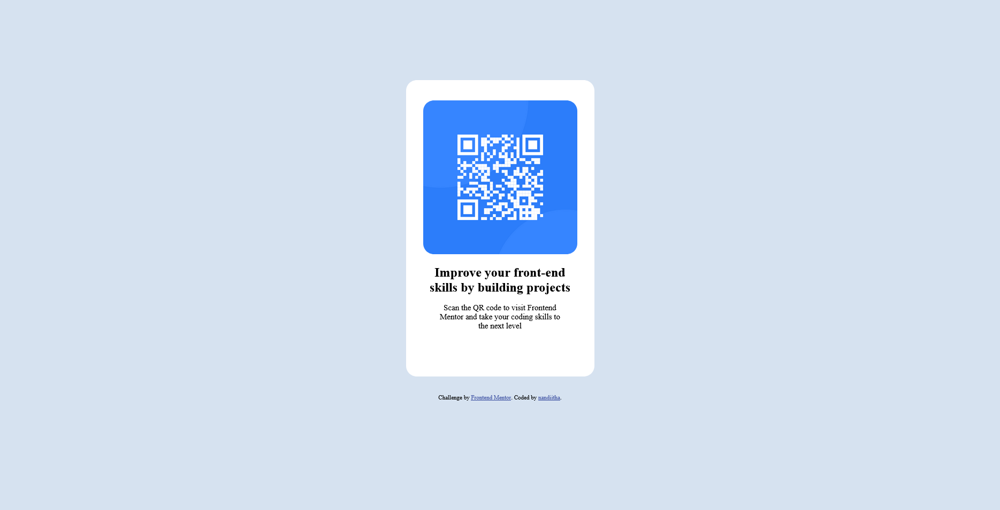

# Frontend Mentor - QR code component solution

This is a solution to the [QR code component challenge on Frontend Mentor](https://www.frontendmentor.io/challenges/qr-code-component-iux_sIO_H). Frontend Mentor challenges help you improve your coding skills by building realistic projects.

## Table of contents

- [Overview](#overview)
  - [Screenshot](#screenshot)
  - [Links](#links)
  - [Built with](#built-with)
  - [What I learned](#what-i-learned)
  - [Continued development](#continued-development)
- [Author](#author)

## Overview

Created a QR-Code scan page with html and css.

### Screenshot

### Links

- Solution URL: [Add solution URL here](https://your-solution-url.com)
- Live Site URL: [Add live site URL here](https://your-live-site-url.com)

### Built with

- HTML
- CSS custom properties

### What I learned

I used CSS from scratch in this project and make the page responsive which I used to struggle to do.

### Continued development

I would like to improve the responsive aspects of pages.

## Author

- Frontend Mentor - ["nandiitha](https://www.frontendmentor.io/profile/nandiitha)
